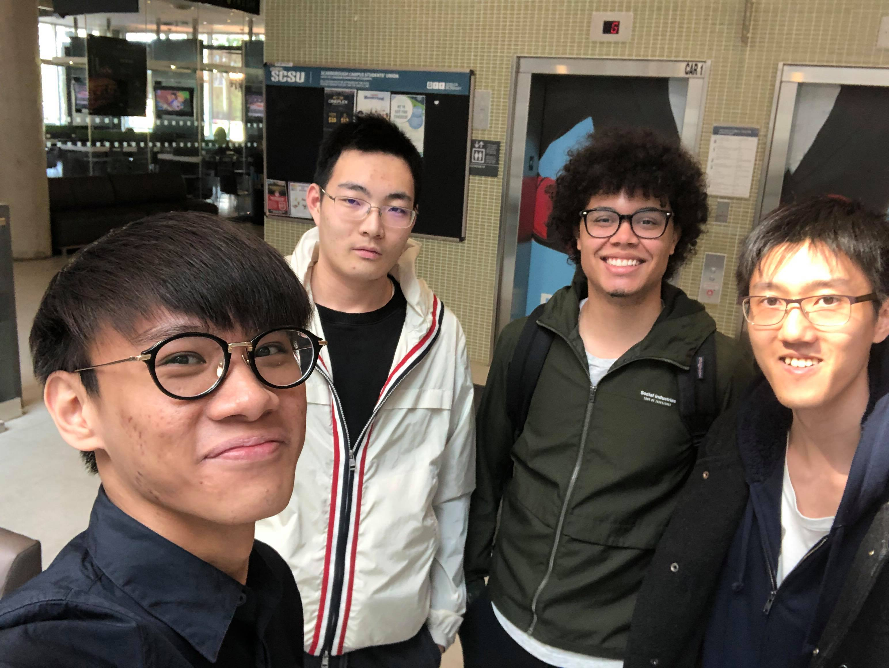

# CSCC01 Project Process

## Team Introduction

## Team Organization and Communication

Building the chatbot requires equivalent effort on both front-end and back-end, so we split our team into two groups, two responsible for front-end and back-end respectively. Most of the time, we will be using Messenger as the communication platform, because it is the most common and convenient way to chat. Other than that, we will be meeting in person twice a week too, as we have lectures and tutorials together. If any emergencies came up, we will make phone calls to discuss the matter.

## Decision Making and Priorities

We will make most of our important decisions in person or through phone calls, for example, the change of design of UI. This is because they may affect the structure of whole project, so we need a consistent on that. If there are some minor adjustments that will not affect the structure, we will simply make our own decision and leave it in group chat and JIRA, so other team member will still notice that. Otherwise, the development will be very slow if every single decision needs to be agreed by everyone. Right after we add any features in a new branch, it will not be merged until everyone read through and understand it. This ensures the process of the project are tracked by everyone and avoids conflicts made by different team members.
Among all the user stories, we will identify the most common ones as the priorities, because that will represent the majority of our users; the need of those which do not compile with our design is the difficulty, because we might need to alter our design to make sure they can be covered.

# Conventions
For the next phase of the project our team has agreed on the following coding conventions:

### Coding Conventions
  - All variables will be in camel case
  - Google-style.xml will be used to ensure that all spacing and margins are consistent
  
### Development Conventions
  - We will use Maven as our build manager
  - We will develop with a test driven approach

### GIT Conventions
  - GIT branches will follow the naming convention group/foo so that all branches related to a particular feature/fix are easily recognizable
  - Commit messages will be fewer than 50 characters
  - Recursive merge will always be used

## Next phase

Our group was just formed two weeks before, so we are not that familiar with each other and not that responsive in the group chat. As such, in the next phase, we will be meeting each other more frequently, and do something else together, such as team lunch, in order to build team chemistry. 